# Internet & Network Technologies

<b style="color:teal">
Begin 14.02.2022
</b>

## Standards

- Standards declared by **Cisco** are reliable.
- IPv4 founded 1981

### Active components

- LTW
- PoE injector

### Passive components

- Cable (30-35 cts per meter) [Cat7]
- Antenna
- Jack
- Power outlet

### Fiber splicing

connecting multiple optical fiber cables

## Future proving

- Be able to replace cables
- Cable through big tubes with lots of air

## ARPANET found as internet

Das ARPANET (Advanced Research Projects Agency Network) war ein Computer-Netzwerk und wurde ursprünglich im Auftrag der US Air Force ab 1968 von einer kleinen Forschergruppe unter der Leitung des Massachusetts Institute of Technology und des US-Verteidigungsministeriums entwickelt.

Used by:

- Military
- Universities
- Helping companies

Cisco produced the first router

- Really good Op-sec
- People hate it because of the bad user-interface
- So they founded the cisco-network-academy
  - The people didn't know the difference between a router and a switch...but the knew how to configure it
  - It is now the biggest online-teaching platform
  - For us @srh it is free of use
    - CCNA is relevant
    - There is a simulator (Download executable)
    - CCNA 1 is mandatory to complete for the course (Introduction into networks & Switching, Routing and Wireless Essentials)
    - CCNA 1-4 optional but a good investment

## Optical fibers

100m length limit in ethernet because it is a timing problem and not a problem of signal strength or throughput

## Network devices

Router
Switch
Repeater
(Modem)
Access-Point (AP)
Cable
"Bridge"

### Homerouter (Eierlegende Wollmilchsau)

1. Modem (With or without...determined by ethernet in or optical or dsl) (Optical fiber doesn't need a modem)
2. Router (They do NAT)
3. (Ethernet)-Switch (With Hardware frontend on the H-Roter)
4. (Included) Access-point
5. VOIP (Often)
6. Web interface (With web-server)
7. USB (Sometimes)

## Coarse classification

- LAN (Local Area Network)
  - Ethernet as we use it
  - My Network
- WAN (Wide Area Network)
  - Long distance technology
  - Third party
- MAN (Metropolitan Area Network)
  - Long distance technology but own administration
  - SRH connecting with other universities
- PAN (Personal Area Network)
  - Devices in a network ON YOUR body
- GAN (Global Area Network)

ISO/OSI 7-Layer-model - TCP/IP

International Standards Organisation/ Open System Interconnections

| Number | Layer          | Typical                 | TCP/IP              | Additional information  |
| :----- | :------------- | :---------------------- | :------------------ | :---------------------- |
| 7      | Application    | Apps,WWW,Servers        | Process/Application |                         |
| 6      | Presentation   | html, mp3, H.264, PGP   | Process/Application |                         |
| 5      | Session        | SQL, Time-service       | Process/Application |                         |
| 4      | Transport      | UDP, TCP, Port-number   | Host-To-Host        |                         |
| 3      | Network        | Internet, Router, IP    | Internet            | Not needed to be usable |
| 2      | Datalink       | Ethernet, switch, MAC   | Network Access      |                         |
| 1      | Physical (PHY) | Cable, wavelength, code | Network Access      |                         |

**SOHO** = Small Office Home Office

### Security

Cisco says the one with the physical access to the device can do anything.
So lock them away and keep the key secure.

<b style="color:teal">
End 14.02.2022
</b>

 

<b style="color:teal">
Begin 15.06.2022
</b>

## Cisco Packet Tracer

- Switch works once powers on the first time
- Router (is a gateway to other networks) needs configuration the first time it starts up

0/0/0 Router/MainModule/SubModule

Physical/Logical Topology

## That what we call a network

### Packet oriented (packet switched)

- Less resources needed
- Flexible and scalable
- Complex
  - Media-Access-Control an Addressing needed
  - Special Protocols for Administration (many!)
  - Big to huge Overhead
  - SLOW!!!
- Standards mandatory

MAC address and IP Address relationship is lost after 5 minutes.

- Bus System (Token-Ring system)
  - Echo
  - Terminator (50 Ohm)

### Requirements

- Fast (Data rate "Bits/sec")
  - Unpack (ethernet) frame & repack frame is slow
- Fast (Latency/ "Ping-rate")
- Save (Hacker, Malware...)
- Save (Fault tolerance)
- Stability/reliability (up-time)
- Scalable (able to grow)
- Open (Standard)
- Less total costs (cost of ownership)
- Able to administrate or all automatic

### Network types

- Mainframe with Terminals (Serial) old!!!
- Field-busses (RS485, CAN-Bus, Profibus, KNX, I2C, ...) (connection between screen and pc)
- Interfaces (RS232, SATA, USB, IEEE1394, NFC, ...)
- Proprietary networks (many field-busses)
- Infrastructure networks
- AD-HOC-Networking

Bigger packets/chunks take priority

### Physical topologies

- Bus
- Star
- Extended star
- Hierarchical
- Ring, double ring
- Mesh
- Cellular
- Irregular

<b style="color:teal">
End 15.06.2022
</b>

<b style="color:teal">
Begin 16.06.2022
</b>

## Topologies

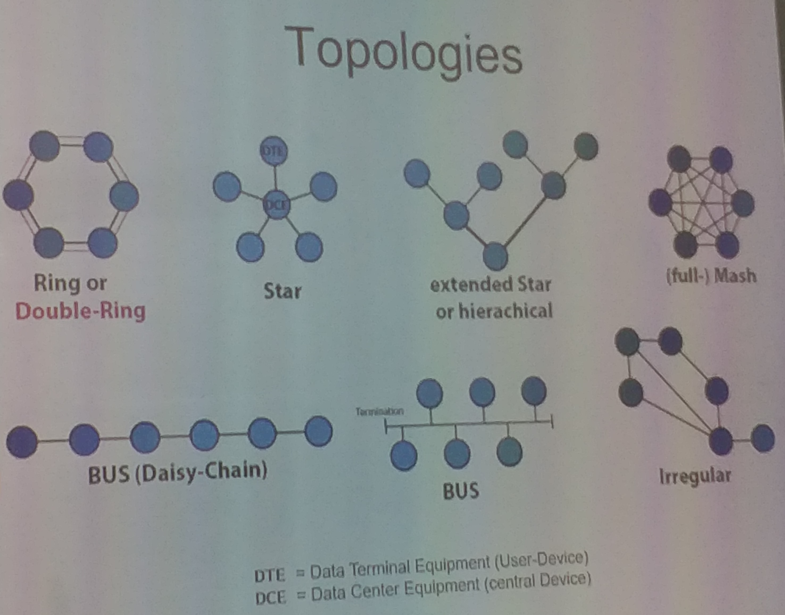

### Ring or double ring

- Ring (A describes direction of flow)
- Ring (B describes direction of flow)
- There are multiple rings for fallback reasons

## Terms

- BNC (British Navy Connector)
- Switches can be combinations between switches and routers

## Features of routers

- Routers can measure the load on cables and then perform load balancing

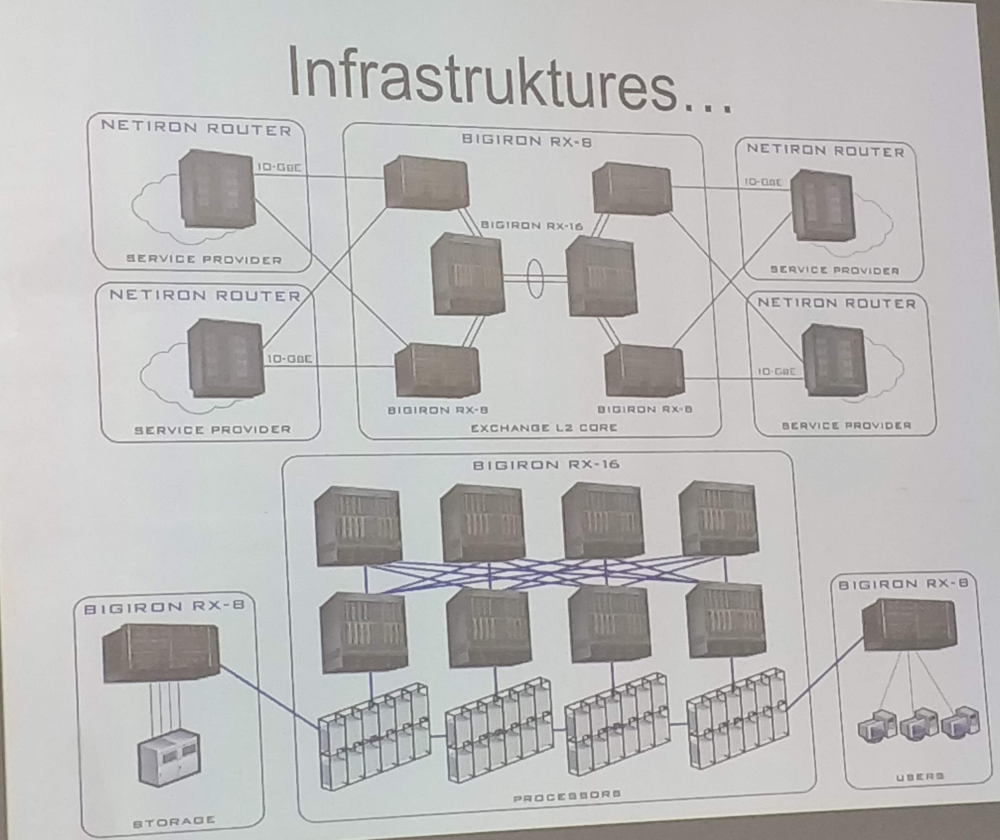

## Features of cables

### U/UTP (Unshielded twisted pairs)

- Typically green, blue, orange, brown colors
- Problem crosstalk: Prevent the cables from touching one-another

### F/UTP (Foiled UTP)

- Foil around the cable
- Good isolation from outside but does not prevent crosstalk

### U/FTP (Foiled twisted pairs)

- Foil around each pair

### SF/UTP (Shielded & Foiled UTP)

### S/FTP (Shielded FTP cable)

<b style="color:teal">
End 16.06.2022
</b>

<b style="color:teal">
Begin 17.06.2022
</b>

## Wired pairs

### RJ45 (Registrated Jack)

- A jack with 8 pins

#### Telephone outputs

- 3, 4 pin

- Telefax outputs

#### Ethernet is applied in the (extended) star topology

- Jack is called RG45
- 1, 2, 3, 6

#### Vectoring

- Prevention of crosstalk by removing concurrency
- Like a scheduler

### Cables

#### Patch cable

DCE - DTE for Star topology

1 to 1
2 to 2
3 to 3
4 to 4
5 to 5
6 to 6
7 to 7
8 to 8

#### Cross over or X over cable

DTE - DTE
DCE - DCE

1 to 3
2 to 6
3 to 1
4 to 4
5 to 5
6 to 1
7 to 7
8 to 8

### Signal interferences

- NEXT/FEXT (Crosstalk)
- ACR = Amplitude vs. Crosstalk relationship
- Attenuation
- DC-Potentials
- Interferences (LF, RF)
- Propagation Delay
- Noise (thermal - Brown movement) SNR

### Benefits of gold

1. No corrosion
2. Soft material so it can be formed a little on connection to make the surface area bigger

## Optical fiber

- Polymere -> TOS-Link (Audio-AC3...)
- Glass:
  - Multimode Step-Index
  - Multimode Gradient-Index
  - Singlemode (mono-mode)
  - Advantage:
    - Galvanical insulation
    - EMF/RF-resistance
  - Disadvantage:
    - Complex and expensive
    - Mechanical weak

### Features

- Diameter (125 micrometers)
- Single-Mode (Step-index => Inside diameter is 9 micrometers)
- Multi-Mode
  - Step-index (Diameter => 62,5 micrometers)
  - Gradient-index (Diameter => 50 micrometers)
- Ping time slower than copper
- Throughput is larger than copper
- Max length is much higher than copper cables => less repeaters

#### Glass types

- Inner glass (core-glass)
- Outer glass (cladding glass)

<b style="color:teal">
End 17.06.2022
</b>

<b style="color:teal">
Begin 18.06.2022
</b>

## Step-index multimode fibre

### Advantage

- Simple to splice
- Simple and cheap connectors
- Cheap active components (LED)

### Disadvantage

- Short distances (< 1km)
- Low bandwidth (< 1Gbit/s lengths < 100m)
- No WDM possible

### Used for

- Backbone - inside buildings old!!!
- Not for new installations!!!

### Why not in use anymore?

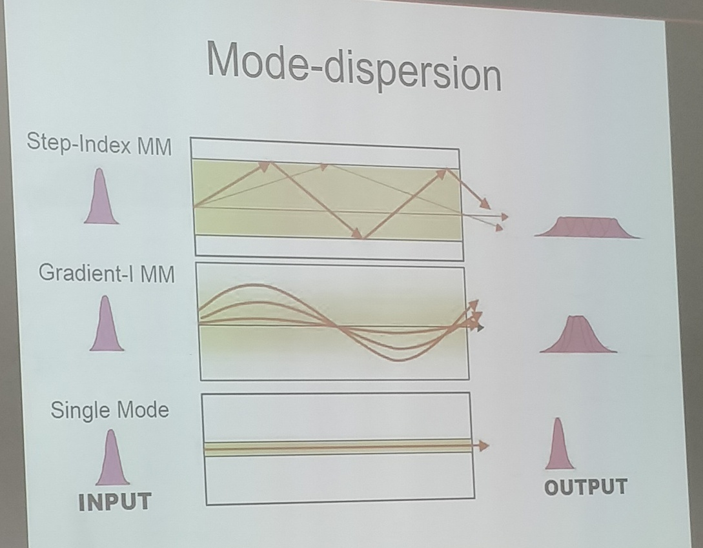

## Gradient-index-multimode fibre

### Advantages

- Simple and cheap jacks
- Cheap active components (LED)
- Higher bandwidth (< Tbit/s)

### Disadvantages

- More complex to splice
- Short distances (< 3km)
- No WDM possible

### Used for

- Backbone - Inside and outside buildings
- Standard fiber for campus and companies

## What is a mode (Single-mode/Multi-mode)?

- A path for light to travel

## (Mono-) Single-mode fibre+

### Advantage

- Long distances (w/o repeater 70km)
- Biggest bandwidth (> 1Ebit/s)
- WDM is possible

### Disadvantage

- Expensive active components (Laser)
- Extremely difficult to splice
- High accuracy needed

### Used for

- Long distances - WAN/Trans-Ocean
- More often: Indoor/LAN/Backbone
- Fibre of the future - for all purposes!!!

## Fiber jacks

### Standard

- T-SC (Duplex)
- LC (Duplex)

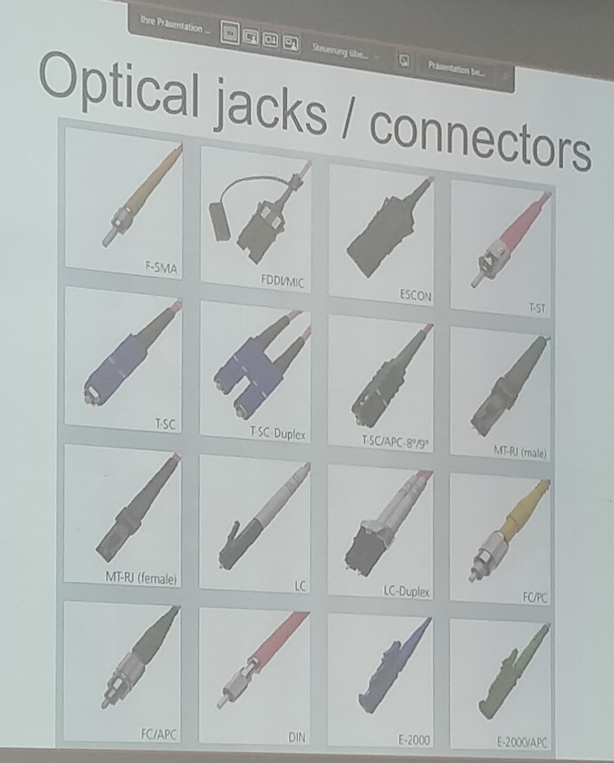

### Long distance fiber architecture

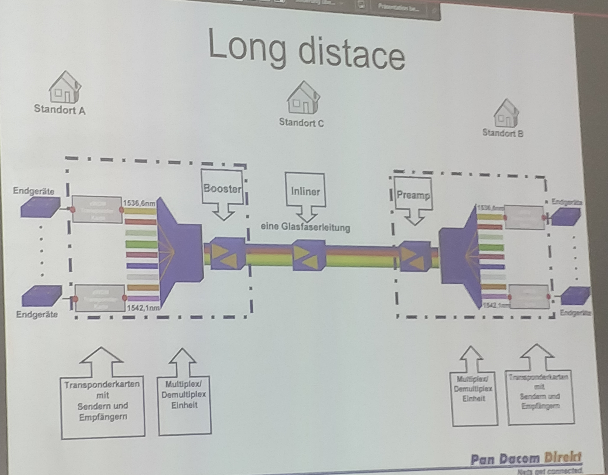

<b style="color:teal">
End 18.06.2022
</b>

<b style="color:teal">
Begin 21.06.2022
</b>

## Laserlink - optical roof to toof

### Highlights Mehrstrahlsysteme

- 16-fache Ausfallsicherheit (4 Tx und 4 Rx)
- Automatische Dämpfungskontrolle
- Autotracking für temperaturbedingte Verbiegung oder gebäudebedingte Schwankung
- Glasfaserschnittstelle
- SNMP-Management

Optical transmission is good in a fiber. Not in the air.

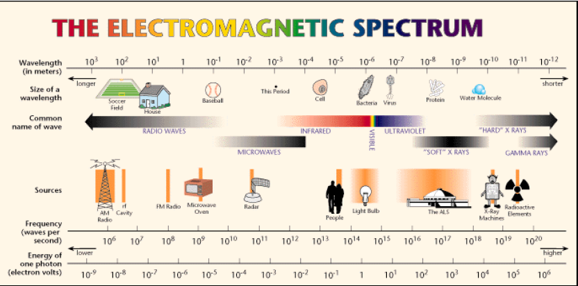

## Coding

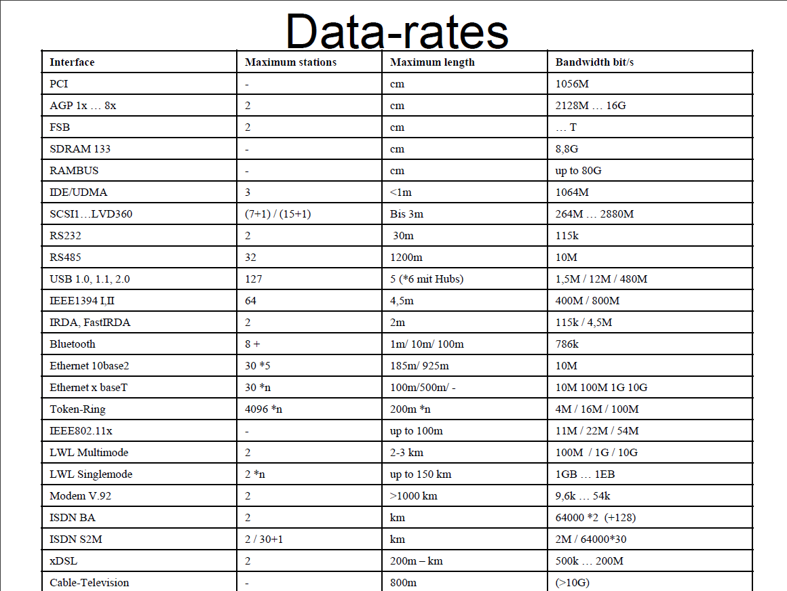

### XOR = Controlled inverter in signaling clock and data

## Clock

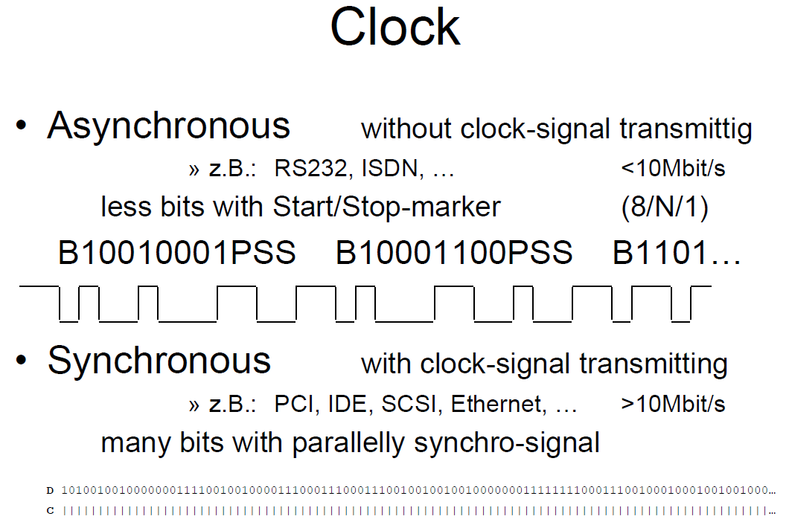

<b style="color:teal">
End 21.06.2022
</b>

<b style="color:teal">
Begin 22.06.2022
</b>

## Transmission-codes

### 3 wishes

- Get bits countable (clock)
- High frequencies
- DC-voltage free

### DC = Gleichstrom

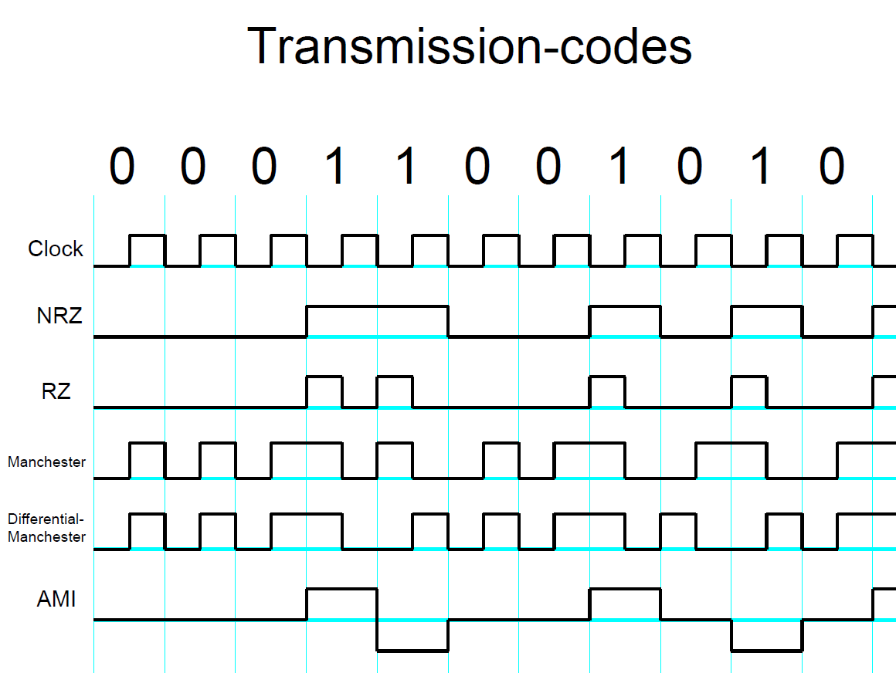

### Manchester

- Best-case 5mhz
- Best-case 10mhz
- Only used for low frequency transmission

### Harmonics

- Always * 3 per harmonic
- 10mhz * 3 = 30mhz per gained harmonic

### Bit/BAUD-rate

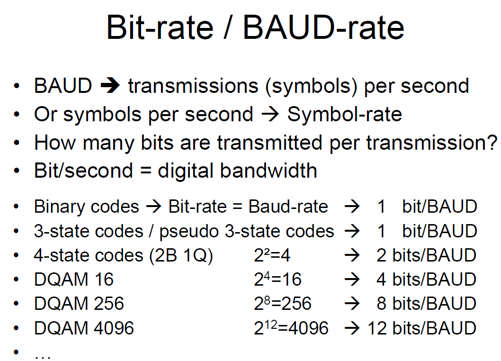

### 2B1Q

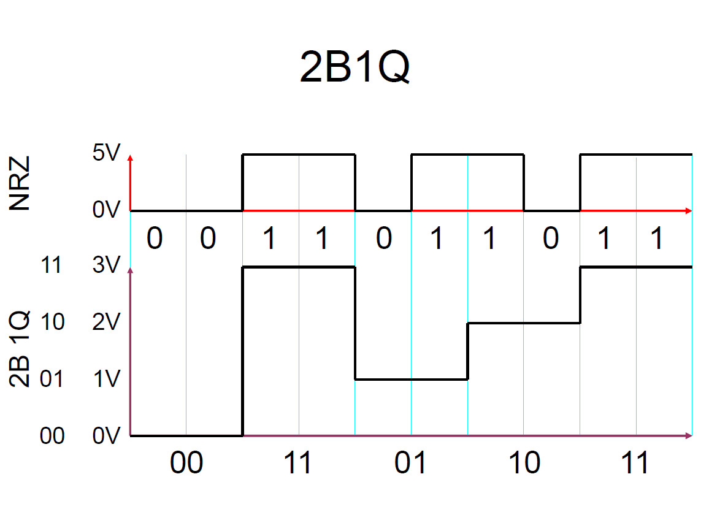

## Modulations

- Baseband, No carrier -> Coding only
- Amplitude-modulation AM
- Frequency-modulation FM
- Phase-shift modulation PM
- Single-side-band-modulation SSB
- Binary-phase-shift-keying BPSK
- Quadratary-phase-shift-keying BPSK
- Quadratur-amplitude-modulation (D-)QAM
- Spread spectrum, DSSS, UWB...

<b style="color:teal">
End 22.06.2022
</b>

<b style="color:teal">
Begin 23.06.2022
</b>

## Two-way-transmissions

### Simplex (One by one, 1 way)

- CB/Ham-Radio
- Railway with one rail only
- 10base2
- 10base5
- WIFI!!!
- (All cell-based)

### Half-duplex (One by one, 2 ways)

- Radio with separated Transmitter and receiver, but only one antenna
- 10/100baseT with Hub

### Full-duplex (Parallel speaking, 2 ways)

- Telephone
- Railway with two rails
- 10/100/1000baseT with crossover or switch
- 10/100/1000baseFx
- optical fiber
- ring-system

### Cast (One way only!!!, 1 way)

- Radio
- TV
- DAB
- DVB
- NO WAY BACK!!!
- (Unicast [Singlecast], Multicast, Broadcast)

## Media-access-control-systems (Layer 2)

- ALOHA (Listen before transmit...)
- CSMA/CD (Ethernet)
- CSMA/CA (WIFI)
  - Carrier Sense Multiple Access/Collision Avoidance
- Token-passing (Token-Ring, FDDI)
- Time-slot (GSM/Sensor networks)
- Master/Slave (WIFI [RTS, CTS], Bluetooth)
- Priority (CAN-Bus)

## Light needs no medium

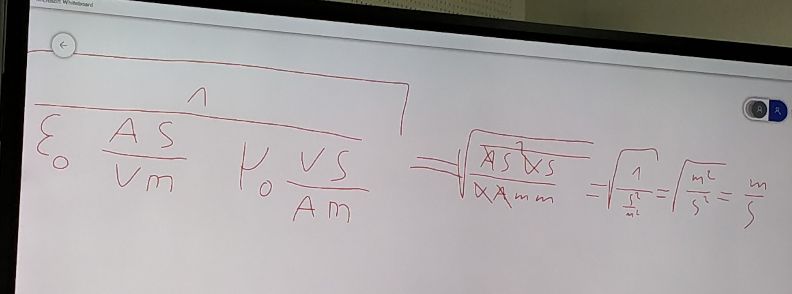

- There is no medium in that formula
- So light does not need a medium

<b style="color:teal">
End 23.06.2022
</b>

<b style="color:teal">
Begin 24.06.2022
</b>

## Ethernet
### First idea (10 base 5 = About 500 meters)

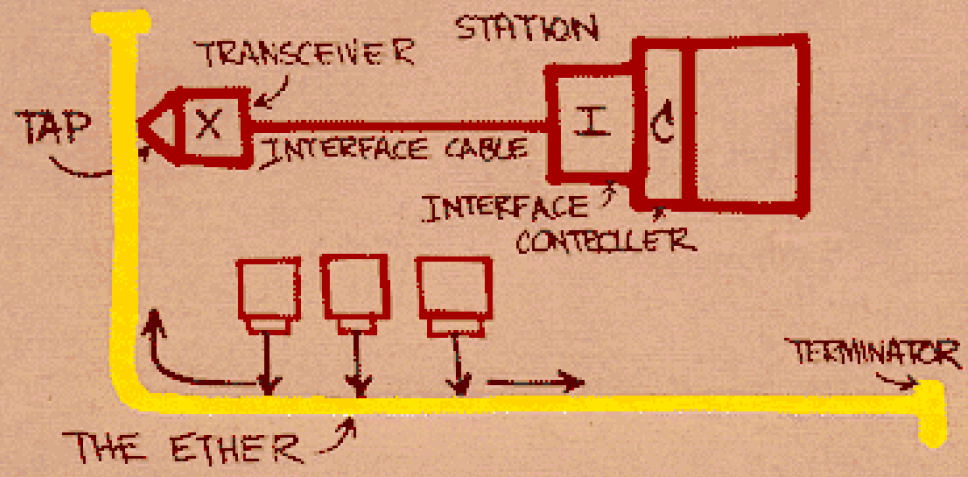

### 10 base 2 = About 200 meters

- 185m Coaxial RG58 - 50Ohm
- Maximum 30 stations/segments
- Bus - no extensions!
- Min. distance between two stations

### 10/100 base Tx

- 100m TwistedPair - Cat. 5-8 100Ohm
- Star - Extended star

<b style="color:teal">
End 24.06.2022
</b>

<b style="color:teal">
Begin 25.06.2022
</b>

## MAC-Adresses

- Also known as hardware-address or physical-address
- 48 Bit-Number (6 Byte) normally written in Hex
- 2^48 combinations -> 281x10^12 MAC-Addresses (2 per 1m^2 land-surface at Planet Earth)
- Combined from Organizationally Unique Identifier and sequential number (Device No. 0,1,2,3,...)
- The OUI will be given by the IEEE (Institute of Electrical and Electronic Engineers)
- Broadcast-address: ff ff ff ff ff ff = 111111111111111111111111111111111111111111111111

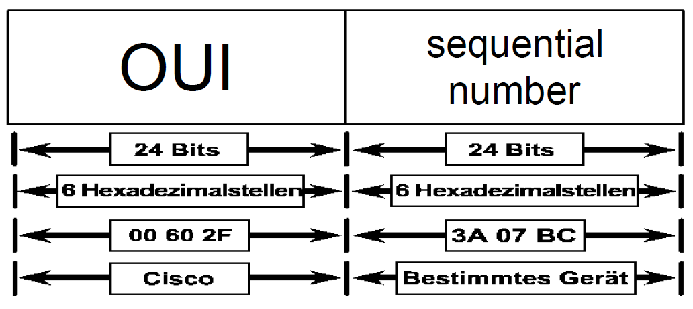

## Ethernet-bridges

- Segmentation = Parallelisation!!!
- Layer2 device means: will make decisions based on MAC addresses
- It‘s a „smart filter“ for frames
- “transparent” (can’t be seen by other
- Generates and uses MAC address tables
  - Will be learned by listening to incoming frames
  - Each entry not in use for 300s will be deleted
- Today normally as a function in other devices
- Forward all MAC broadcasts (Broadcast Domain)

## Ethernet-Switches

- „real name“: Ethernet Switching Hub
- Also called: „Multiport Bridge“ (same rules)
- Hardware based
- ONLY Switches → „micro segmentation“
- Switching Modes:
  - Store and Forward
  - Cut Through
    - Fragmet free
    - Fast Forward

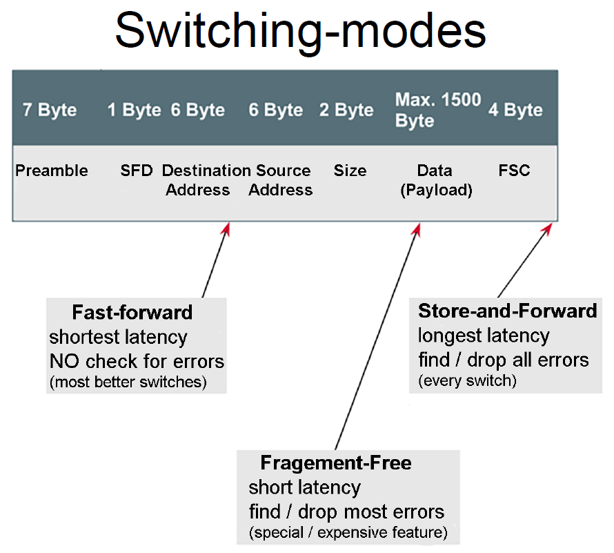

<b style="color:teal">
End 25.06.2022
</b>
