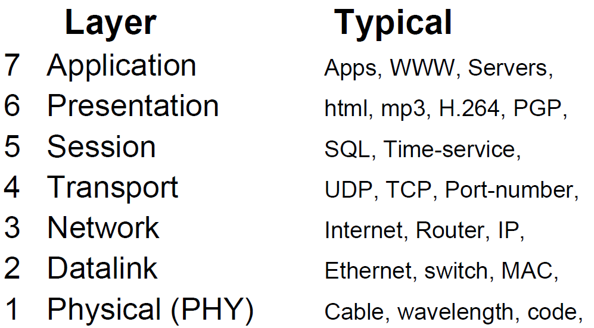

# Preparation of exam

### Find out on a /30 Network: Host / Subnet / Broadcast

### Create a Subnet! Given: Network with mask and minimum of Hosts or Subnets wanted

### Find out: which Class / Public or Private / are there any special functions?

### On the Way from source to destination with NAT- and normal Routers: Source-/Destination- IP- and MAC-Addresses

- See: What happens during a ping in [README.md](./README.md#what-happens-during-a-ping)

### Optical Fibres: Features of 9/125 and 50/125 and 62.5/125

### Connect with Ethernet: PC-PC / PC-SW / SW-SW / with and without Uplink-port by 10/100/1000Mbit/s What Cable do you need?

Was macht der Uplink-Port?

Will man einen Switch mit einem anderen Switch über ein normales Netzwerkkabel (Patchkabel) verbinden, benötigt man den Uplink-Port. Dieser vertauscht das Sender- und Empfängerpaar der Ports, damit das Ganze funktioniert. Alternativ geht das auch ohne Uplink-Port. Dazu muss man allerdings ein Crossover-Cable nutzen, welches den gleichen Effekt hat.

Letzteres ist heutzutage nicht mehr notwendig, dank der Auto Uplink-Technologie. Der Port erkennt, ob es sich um eine Verbindung zu einem Computer (Empfangen) oder eine Uplink-Verbindung zu einem Switch oder Router (Senden) handelt.

### Simplex / half-Duplex / full-Duplex: what kind of is: Telephone, 10base-T with SW, …

### What are typical LAN-/WAN-Technologies?

#### LAN

- Router
- Switch
- Ethernet
- Wifi
- Optical fiber (9/125, 50/125, 62.5/125)

#### WAN

- Router
- Optical fiber (9/125)

### What do you need to configure when you want PCs to communicate in a LAN?

- IP-Address can be set manually or automatically by DHCP-Server

### Characteristics of TCP- and UDP-Protocol?

### Types of Routing: how do we call it when…?

- Distance Vector (RIP, IGRP...)
- Hybrid, (EIGRP...)
- Link-State (OSPF, BGP...)

### On an LAN: Which devices needs MAC- and/or IP-Addresses?

### Switching-Modes: Advantages and disadvantages?

- Store and Forward
  - Advantage:
  - Disadvantage:
- Cut Through
  - Fragmet free
    - Advantage:
    - Disadvantage:
  - Fast Forward
    - Advantage:
    - Disadvantage:

### How a router is doing routing?

### Special IPv6-Adresses: (local host, internet, private IP, APIPA, multicasts)

| -                                  | IPv6             |
| :--------------------------------- | :--------------- |
| Not defined =*                     | ::               |
| Loopback (localhost)               | ::1              |
| IPv4(e.g. 192.168.1.2)             | ::FFFF:C0A8:0102 |
| Global publicIP                    | 2000:: - 3FFF::  |
| Unique Local Unicast private IP    | FC00:: - FDFF::  |
| Linklocal/auto-configuration APIPA | FE80:: - FEBF::  |
| Multicast                          | FF00:: - FFFF::  |

### Optical fibres: how to use it in-house

- No multiplexing (wdm)
- Only one direction and wavelength per fiber

### Find out Size of subnet (first and last host)

### Idea of RIP-Routing

**Metric / Administrative distance** (For Routing protocols)

### Function of TTL

A field that specifies the number of hops a packet may travel. This number is decreased by one as the packet travels through a router. When the counter reaches zero the packet is discarded. This prevents packets from looping endlessly.

### Function of loopback

Used to identify current device (localhost)

### Pinout Ethernet 10/100Mbit/s

2 pairs

### Pinout Ethernet Gigabit/10Gig

4 pairs

### ISO/OSI-Model: Layers and Encapsulation

### Typical „Problem-maker“-Protocols

- Protocols that make use of broadcasts like
  - ARP
  - SNMP
  - RIP
- Too many broadcasts. If broadcasts would be omitted we could use only switches worldwide

### AWG-Sizes for Ethernet

- AWG 23, 22
- About the gauge of the cable
- Influences the max available current
- Interesting for PoE
- Not interesting for patch-cable (Maybe about the resistance)

### Spanning-Tree-Protocol: Advantages and Disadvantages?

#### Advantages

##### Simplification of Bridging Logic

One of the most important aspects of STP is that it avoids the bridging logic problem that comes into play when many computers are using a local area network at the same time. Each device uses different active paths that approach the same network address, confusing the logic of the network and preventing information from getting to where it needs to go. The algorithms for STP eliminate this confusion by establishing a root bridge that sees all traffic in the network and ensures efficient data forwarding.

##### Prevention of Loops

Enterprising Networking Planet states that, in addition to the STP algorithm allowing information to flow safely between devices, it also stops the potential for loops. When there are multiple network paths open to a device, loops may occur, and data can potentially be sent to a single source several times (or to the wrong place entirely). Loops can clog or crash a network. The STP algorithm creates a diagram that limits the number of open paths and arranges them in a way where information is sent from one device to another and then changed. This diagram helps devices to both communicate with each other and send data among each other freely.

##### Preventing Connection Problems

STP offers various backups that become active when the main connection experiences technical hiccups. These backups are possible because the STP has several paths from which to choose. According to Orbit Computer Solutions, at any given moment there is only one open path for each device to access the different switches of a network. When one path is functioning poorly or not functioning at all, the STP closes it and opens another path. This pattern explains what it means when the STP changes its algorithms in the event of a change in the network.

#### Disadvantages

- Restricting traffic to this unique path means blocking alternative, and sometimes more direct, paths.
- That means that your full potential network capacity can never be realized.
- In the past this has been acceptable, but with the increasing use of virtualization technology in many data centers, there is a need for a more efficient and reliable routing infrastructure that can handle the very high I/O demands of virtualized environments.

### PoE: Typical usage

- Power over Ethernet
- Used to power devices over current transported over ethernet-cables
- Modes:
  - Spare-pair injection (A)
  - Phantom injection (B)
- High current requires high AWG (Big gauge)

### Normal function of a Switch: destination unknown / too long time no transmissions / …

- Unknown Unicast: When a switch receives a unicast frame for a destination for which the switch has no entry in its MAC table then the switch simply broadcasts the frame through all ports. This is known as flooding.
- Longer than 300s no transmission: Entry in MAC-table (CAM (Content Addressable Memory)) gets removed

**VLAN: what must be configured on a Switch?**

- Static (Manual per Port)
- Dynamic
  - Similar to dhcp

### How many bits per BAUD if binary, QPSK (2), D-QAM-16, D-QAM-64, D-QAM-256, or … is used?

- Binary (1)
- QPSK (2)
- D-QAM-16 (4)
- D-QAM-64 (6)
- D-QAM-256 (8)

### Which type of Ethernet-Cable (Cat 5, 5e, 6, 6e, 7, …) do you choose for cabeling a new big office?

- Cat 8, since it is the newest category with the best performance and the biggest possible throughput

#### IPv6: create Subnets for private network (15 / 255 / 65k / … Hosts)
